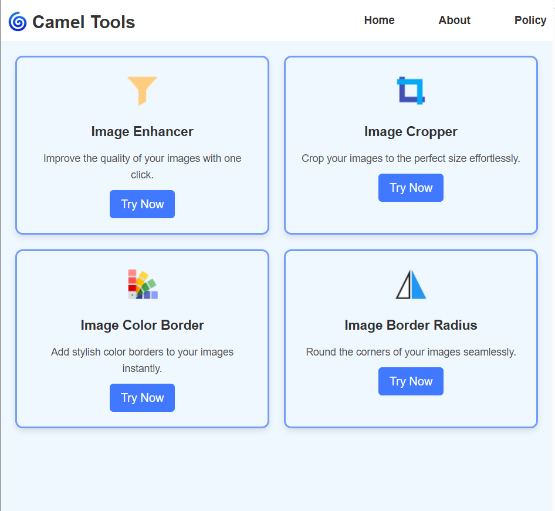

# Surya Camel Tools

Surya Camel Tools is an innovative web application designed to provide tools and utilities for efficient workflow and productivity. This repository contains the source code for the project.

## Live Demo

The application is live and can be accessed here: [Surya Camel Tools](https://camel-radius.vercel.app)



## Features

- **User-friendly Interface**: Simple and intuitive design for seamless user experience.
- **Tool Integration**: A variety of tools for enhanced productivity.
- **Performance**: Optimized for fast loading and smooth performance.
- **Responsive Design**: Works across multiple devices and screen sizes.

## Technologies

The project leverages the following technologies:

- **Frontend**: [React.js](https://reactjs.org/) for building the user interface.
- **Backend**: [Node.js](https://nodejs.org/) for server-side operations.
- **Styling**: [CSS-in-JS](https://emotion.sh/) for styling components.
- **Hosting**: Deployed on [Vercel](https://vercel.com/) for scalable and high-performance hosting.

## Quick Start

### Prerequisites

Ensure you have the following installed:

- [Node.js](https://nodejs.org/) (v14 or later)
- [npm](https://www.npmjs.com/) or [yarn](https://yarnpkg.com/)

### Clone the Repository

```bash
git clone https://github.com/nallamothusurya/surya-camel-tools.git
cd surya-camel-tools
```

### Install Dependencies

```bash
npm install
# or
yarn install
```

### Run the Application

```bash
npm run dev
# or
yarn dev
```

The application will be available at [http://localhost:3000](http://localhost:3000).

## Deployment

The project is deployed on [Vercel](https://vercel.com/). To deploy your own version:

1. Fork the repository.
2. Link the forked repository to your Vercel account.
3. Configure environment variables, if any.
4. Deploy the project.

## Contributing

Contributions are welcome! Please follow these steps:

1. Fork the repository.
2. Create a new branch for your feature or bugfix: `git checkout -b feature-name`.
3. Commit your changes: `git commit -m "Description of feature/fix"`.
4. Push to your branch: `git push origin feature-name`.
5. Create a pull request.

## License

This project is licensed under the [MIT License](LICENSE).

---
Developed with ❤️ by [Ayyappa Venkata Surya](https://github.com/nallamothusurya)
